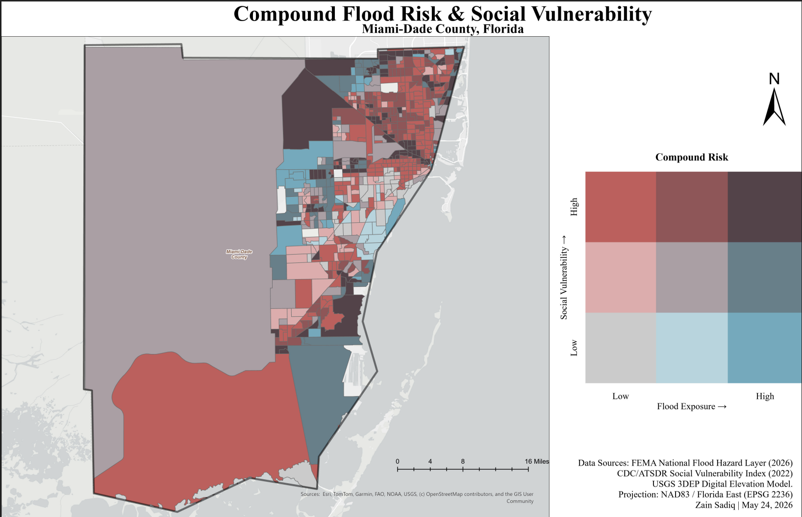

# Compound Flood Risk & Social Vulnerability Analysis
### Miami-Dade County, Florida

  

---

## Overview

This project identifies census tracts in Miami-Dade County, FL where high flood hazard exposure compounds existing social vulnerability. The analysis integrates FEMA flood zone data, CDC Social Vulnerability Index (SVI) scores, and USGS elevation data to produce a **bivariate choropleth map** — the primary deliverable — that visualizes compound disaster risk at the census tract level.

The core question driving this analysis:

> *Where do high flood hazard areas overlap with socially vulnerable populations — and how severe is that compound risk?*

This type of compound risk analysis directly informs equitable disaster resilience planning, FEMA Community Rating System scoring, and HUD climate adaptation grant targeting.

---

## Display



---

## Key Output

**Bivariate Choropleth Map** classifying all Miami-Dade census tracts across a 3×3 grid of flood exposure (x-axis) and social vulnerability (y-axis), using the Joshua Stevens color scheme (pink/red × blue → dark purple for compound high-risk tracts).

### Findings
- **110 tracts** fall in the highest compound risk category (High SVI + High Flood Exposure), concentrated along Miami-Dade's coastal corridor
- **193 tracts** show High SVI with low-to-moderate flood exposure — populations with limited adaptive capacity even outside the primary flood zone
- Wealthy coastal tracts (Miami Beach, Key Biscayne) show high flood exposure but lower social vulnerability — a distinct risk profile from inland communities

---

## Data Sources

| Dataset | Source | Year | Geography |
|---|---|---|---|
| National Flood Hazard Layer (NFHL) | FEMA Map Service Center | 2026 | Polygon — flood zone boundaries |
| Social Vulnerability Index (SVI) | CDC/ATSDR | 2022 | Census tract |
| Digital Elevation Model (3DEP) | USGS National Map | Current | 1/3 arc-second raster (~10m) |
| County Boundary | Esri Living Atlas | Current | Polygon |

---

## Methodology

### 1. Data Preparation
- All layers projected to **NAD83 / Florida East (EPSG 2236)** — US Survey feet, standard for Miami-Dade county planning
- All layers clipped to Miami-Dade county boundary
- SVI tracts filtered to remove no-data records (`RPL_THEMES ≠ -999`)

### 2. NFHL Flood Zone Reclassification
FEMA flood zones reclassified into a 3-tier hazard score:

| FEMA Zone | Hazard Score | Description |
|---|---|---|
| VE, V, AE, A, AO, AH, A99 | 3 — High | 1% annual chance (100-yr floodplain) |
| X (shaded) | 2 — Moderate | 0.2% annual chance (500-yr) |
| X (unshaded), D | 1 — Low | Minimal / undetermined hazard |

Score assigned via `Calculate Field` (Python) on `FLOOD_SCOR` field.

### 3. DEM Processing
- **Hillshade** generated (azimuth 315°, altitude 45°, Z-factor 3) for terrain backdrop
- **Slope raster** derived for drainage pattern context
- Z-factor elevated to account for Miami-Dade's extremely flat terrain (0–82 ft elevation range)

### 4. Flood Exposure at Census Tract Level
- `Intersect`: FEMA Score 3 polygons × SVI census tracts
- `Calculate Geometry`: flooded area per intersected polygon (sq ft)
- `Summary Statistics`: summed flooded area by tract FIPS code
- `Join` summary back to SVI layer
- `PCT_FLOOD` = (flooded area / total tract area) × 100
- `NORM_FLOOD` = PCT_FLOOD / 100 (normalized to 0–1 scale)

### 5. Compound Risk Score
Equal-weighted compound risk combining normalized flood exposure and overall SVI:

```
COMP_RISK = (NORM_FLOOD × 0.5) + (RPL_THEMES × 0.5)
```

### 6. Bivariate Classification
Each variable independently classified into 3 equal-interval tiers (0–0.33, 0.33–0.66, 0.66–1.0):

| Field | Classes |
|---|---|
| `FLOOD_CLASS` | 1 = Low, 2 = Med, 3 = High flood exposure |
| `SVI_CLASS` | 1 = Low, 2 = Med, 3 = High vulnerability |
| `BIVA_CLASS` | Concatenated code: `SVI_CLASS` + `FLOOD_CLASS` (e.g. "33" = highest compound risk) |

### 7. Bivariate Choropleth (Joshua Stevens Color Scheme)

| BIVA_CLASS | SVI | Flood | Color |
|---|---|---|---|
| 11 | Low | Low | `#e8e8e8` |
| 12 | Low | Med | `#b0d5df` |
| 13 | Low | High | `#64acbe` |
| 21 | Med | Low | `#e4acac` |
| 22 | Med | Med | `#ad9ea5` |
| 23 | Med | High | `#627f8c` |
| 31 | High | Low | `#c85a5a` |
| 32 | High | Med | `#985356` |
| **33** | **High** | **High** | **`#574249`** |

---

## Tract Distribution by Bivariate Class

| Code | SVI Level | Flood Level | Tract Count |
|---|---|---|---|
| 11 | Low | Low | 44 |
| 12 | Low | Med | 20 |
| 13 | Low | High | 32 |
| 21 | Med | Low | 65 |
| 22 | Med | Med | 51 |
| 23 | Med | High | 60 |
| 31 | High | Low | 193 |
| 32 | High | Med | 88 |
| **33** | **High** | **High** | **110** |

---

## Tools & Software

- **ArcGIS Pro** — primary GIS platform
- **Spatial Analyst extension** — raster processing (hillshade, slope)
- **Python 3** (Calculate Field) — field classification logic
- **FEMA MSC Portal** — NFHL data download
- **CDC/ATSDR SVI Portal** — SVI geodatabase download
- **USGS National Map Downloader** — 3DEP DEM tile download

---

## File Structure

```
FloodRisk_MiamiDade/
├── Data/
│   ├── FEMA/
│   │   ├── NFHL_MiamiDade          # Clipped NFHL flood zones
│   │   └── Floodplain_Score3       # Score 3 (high hazard) polygons only
│   ├── SVI/
│   │   ├── SVI_MiamiDade           # Clipped SVI census tracts
│   │   └── SVI_FloodExposure       # Final analysis layer (all fields)
│   └── DEM/
│       └── DEM_MiamiDade.tif       # Clipped elevation raster
├── Outputs/
│   ├── Hillshade_MiamiDade         # Terrain backdrop raster
│   ├── Slope_MiamiDade             # Slope raster
│   └── Flood_Tract_Intersect       # Intermediate intersect layer
└── Maps/
    └── FloodRisk_SVI_MiamiDade_Bivariate.pdf
```

---

## Coordinate Reference System

**NAD83 / Florida East (EPSG 2236)**
- Units: US Survey Feet
- Rationale: Standard CRS for Miami-Dade county-level planning; matches FEMA base flood elevation reporting units for Florida

---

## Limitations

- NFHL flood zones reflect regulatory mapping, not real-time or projected future flood risk — sea level rise scenarios are not incorporated
- SVI scores are ranked within Florida only (`RPL_THEMES` reflects state-relative vulnerability, not national)
- Equal-interval classification (0–0.33 / 0.33–0.66 / 0.66–1.0) for bivariate classes may obscure distributional nuance; Jenks natural breaks classification is an alternative worth exploring
- Western agricultural tracts show high flood exposure due to Zone A designation but are largely uninhabited — future iterations could weight by population density

---

## References

- FEMA. (2026). *National Flood Hazard Layer*. https://msc.fema.gov
- CDC/ATSDR. (2022). *Social Vulnerability Index*. https://www.atsdr.cdc.gov/placeandhealth/svi
- USGS. (2024). *3D Elevation Program*. https://apps.nationalmap.gov/downloader
- Stevens, J. (2015). *Bivariate Choropleth Maps: A How-to Guide*. https://www.joshuastevens.net/cartography/make-a-bivariate-choropleth-map/

---

## Author

**Zain Sadiq**
GIS Student — Rutgers University
May 2026
